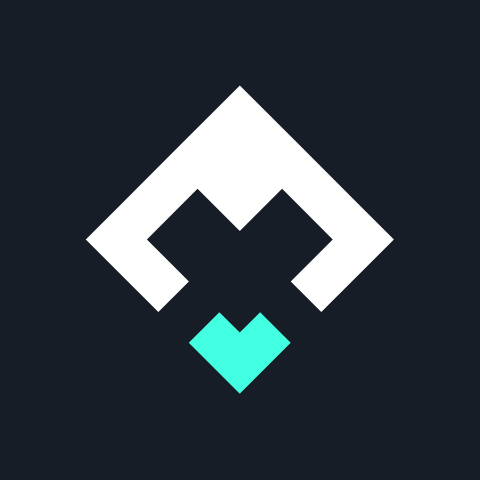
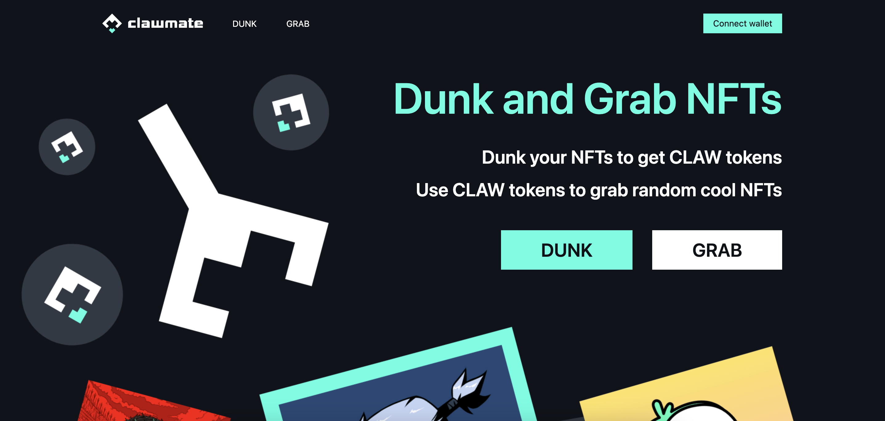

  

  <h1 style="margin-top:8px;">Clawmate</h1>

  

    <strong>Dunk your NFTs into the pool, earn CLAW and grab other NFTs.</strong>
  

  

	  
  

## Inspiration

More and more NFTs are minted every day and many users may find themselves holding NFTs that they consider less valuable or meaningful, either due to changing preferences or market trends.

The idea is to create a protocol that allows holders to get rid of these less desirable NFTs getting rewards that may have broader applicability or appeal, offering an innovative solution to the subjective nature of NFTs valuation.

This approach could foster a sense of community collaboration, encourages liquidity, and explores creative ways to redefine the value proposition of NFTs within the ecosystem.

## What is Clawmate

Clawmate is a protocol that allow users to dunk their NFTs into a pool and obtain CLAW tokens as reward. CLAW tokens can then be used to grab random NFTs from the pool.

The protocol is based on a smart contract that manages the dunk and grab functionalities and provides a functional interface to other contracts, and another smart contract that handles CLAW token rewards.

## How it works

There are two main actions that can be executed at the protocol level: Dunk and Grab NFTs.

### Dunk NFTs

The Dunk action allows a user to transfer a NFT into Clawmate pool and obtain CLAW tokens rewards based on the NFT dunked in the pool. The rarer is the NFT, the higher is the reward.

Only whitelisted NFTs can be dunked in the pool to prevent possible exploits and malicious contracts.

### Grab NFTs

The Grab action allows a user to pay a dynamic amount of CLAW tokens to obtain a random NFT from Clawmate pool.

Randomness in achieved through the usage of an oracle VRF to prevent possible exploits and assure the result of the grab cannot be sorted out in advance.

## CLAW Tokenomics

Clawmate token (CLAW) is the protocol utility token. It is minted as a reward when interacting with the protocol through the dunk function and burned when interacting through the grab function.

Token main characteristics are:

- ERC20 standard compliant
- Dynamic supply with inflation managed through burning and minting when interacting with the protocol
- CLAW symbol
- 18 decimals
- Utility token

## Value proposition

Clawmate protocol brings an innovative way to use NFTs on chain allowing holders to get rid of NFTs not wanted anymore obtaining rewards and giving the possibility to get new ones.

Furthermore, it introduces the possibility of building other contracts upon it thanks to its functional interface allowing integrations with other dapps.

## Architecture

The architecture of the protocol is composed by two smart contracts and a frontend application.

### Smart contracts

- ClawmateManager: handles NFTs dunk and grab functions and store the NFTs pool
  
	Contract deployed on the Injective inEVM testnet
	- Address: 0xA93183e5E583e4698370215447aea53Bf89eeA09
	- Explorer link: https://inevm.calderaexplorer.xyz/address/0xA93183e5E583e4698370215447aea53Bf89eeA09

- ClawmateToken: manages CLAW token, its minting and burning and data

  Contract deployed on the Injective inEVM testnet
	- Address: 0x0D6Dd4bA7300Fd8858Ab0fB854917C6772b1428f
	- Explorer link: https://inevm.calderaexplorer.xyz/address/0x0D6Dd4bA7300Fd8858Ab0fB854917C6772b1428f

### Frontend application

A web application made with nextjs and wagmi libraries to interact with the smart contracts deployed on Injective inEVM testnet.

Web app link: https://clawmate.vercel.app/
