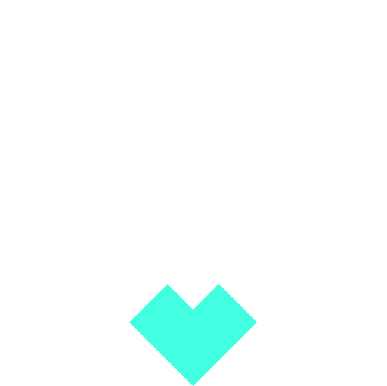

  

  <h1 style="margin-top:8px;">Clawmate</h1>

  

    <strong>Dunk your NFTs into the pool, earn CLAW and grab other NFTs.</strong>
  

## Inspiration

More and more NFTs are minted every day and many users may find themselves holding NFTs that they consider less valuable or meaningful, either due to changing preferences or market trends.

The idea is to create a protocol that allows holders to get rid of these less desirable NFTs getting rewards that may have broader applicability or appeal, offering an innovative solution to the subjective nature of NFTs valuation.

This approach could foster a sense of community collaboration, encourages liquidity, and explores creative ways to redefine the value proposition of NFTs within the ecosystem.

## What is Clawmate

Clawmate is a protocol that allow users to dunk their NFTs into a pool and obtain CLAW tokens as reward. CLAW tokens can then be used to grab random NFTs from the pool.

## How it works

The protocol is based on a NFTs pool and two main actions DUNK and GRAB.

### Dunk NFTs

TODO

### Grab NFTs

TODO

## Tokenomics

TODO

## Value proposition

TODO

## Architecture

TODO

## Useful links

TODO
